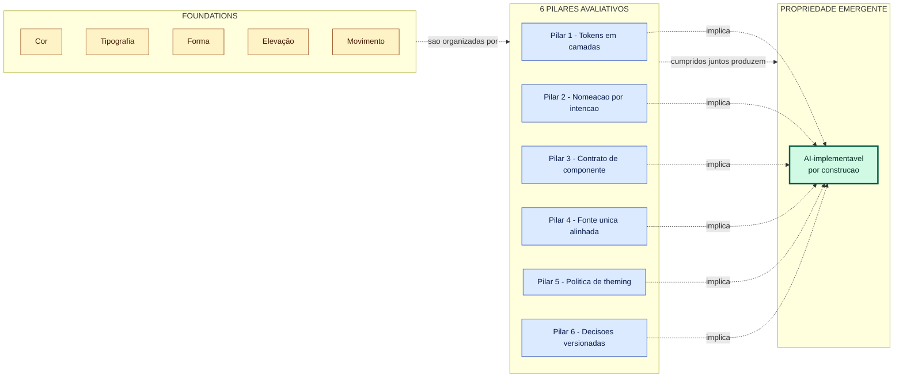

# AI-implementável como propriedade emergente

---

Doc complementar a `design-system-pillars.md`. Lá, os 6 pilares são apresentados como critérios de avaliação de um DS para humanos. Aqui, o ângulo é diferente: **um DS que cumpre os 6 pilares é, por construção, implementável por agente** — sem precisar de mais regras explícitas. AI-implementável não é um pilar à parte. É propriedade emergente.

Pré-requisito de leitura: você precisa conhecer o vocabulário e os 6 pilares de `design-system-pillars.md` (ou um equivalente). Este doc não redefine os termos.

---

## Tese

Os 6 pilares foram desenhados para problemas humanos: rebrand barato, dark mode sem refactor, drift detectável, contrato auditável. **A surpresa é que esses mesmos pilares são exatamente o que um agente de IA precisa para gerar código consistente a partir de um design.** Não é coincidência: ambos os "consumidores" (dev humano e agente) precisam dos mesmos invariantes — nomes que carregam intenção, camadas que isolam mudança, contrato 1:1, decisões consultáveis.

Por isso, "AI-implementável" não é meta separada. É **diagnóstico** de uma qualidade que sempre foi importante. A diferença é que IA torna esse diagnóstico mais visível, mais rápido, mais barato.

---

## O que um agente precisa, em ordem

Agente de IA gerando código a partir de Figma precisa, em sequência:

1. Identificar qual componente do código corresponde ao componente Figma. **(resolvido por: pilar 4 — Code Connect mapping)**
2. Saber qual valor usar onde — texto na cor do quê? **(resolvido por: pilar 1 — camadas, e pilar 2 — nomes semânticos)**
3. Não sobrescrever variants existentes nem inventar novas. **(resolvido por: pilar 3 — contrato)**
4. Saber se uma cor responde a Light/Dark. **(resolvido por: pilar 5 — política de theming)**
5. Não recriar tokens já existentes. **(resolvido por: pilar 4 — drift detection acusa hardcoded)**
6. Saber por que um token existe quando precisa decidir manter ou substituir. **(resolvido por: pilar 6 — decisões)**

Cada item abaixo destrincha como o pilar correspondente entrega isso.

---

## Pilar 1 — Tokens em camadas → agente sabe qual camada bindar

Sem camadas, o agente vê `#EF4444` no Figma e tem três escolhas: bindar `red-500` no componente, criar uma classe ad-hoc, ou hardcodar. Todas erradas.

Com camadas, o agente vê o token bound (`theme.primary`) no Figma, encontra `theme.primary` no CSS, e bind-a no componente. Decisão mecânica.

Sem pilar 1, agentes geram código que "funciona visualmente" mas quebra o DS — multiplicando exatamente o trabalho que o DS deveria evitar.

---

## Pilar 2 — Nomeação por intenção → agente não confunde aparência com propósito

Agente lê "primary" e sabe que essa é a cor principal da brand, independente de matiz. Lê "destructive" e sabe que é ação destrutiva. Não confunde com "azul" — porque o nome não diz "azul".

Quando o agente precisa decidir "esse botão é primary ou cta?", olha para o Figma, vê o token aplicado, replica. Sem inferência sobre matiz.

Pilar 2 evita que o agente caia em armadilhas como "tem `error-red`, vou usar pra status de erro" — sem saber que o time usa `destructive` para isso e `error-red` é primitive.

---

## Pilar 3 — Contrato de componente → agente gera variants corretos

Agente vê `<Button variant="primary" size="md">` no Figma. Para gerar código, precisa que esse contrato exista 1:1 no React. Pilar 3 garante.

Sem pilar 3, o agente vai: tentar `variant="primary"` (não existe no código), inferir `className="btn-primary"` (não convencional), ou gerar inline styles. Saída inconsistente.

Com pilar 3, mapeamento é direto.

A11y (acessibilidade) default é particularmente importante: agente raramente lembra de adicionar `:focus-visible` corretamente. Se o componente já tem por default, agente não precisa nem pensar.

---

## Pilar 4 — Fonte única alinhada → agente detecta o próprio drift

Agente recém-gerado: "vou usar `#FFFFFF` aqui". Hardcoded scanner no CI: "❌ hardcoded em componente". Agente reescreve usando `surface-default`. Auto-correção.

Sem detector, o agente acumula hardcodes e ninguém percebe. O DS degrada lentamente.

Mais sutil: Code Connect mapping permite que agente, ao ler um frame Figma, saiba qual componente do código corresponde — sem precisar inferir do nome (`Card.tsx` pode ser qualquer coisa). Saída determinística em vez de palpite.

---

## Pilar 5 — Política explícita de theming → agente sabe quando aplicar theme

Agente vê uma cor no Figma. É bound em `theme.surface-default`? Aplique theme. É hardcoded `#000`? Pode ser zona theme-independent (correto preservar como hardcoded) ou pode ser bug (deveria ser theme).

Política explícita de theming dá ao agente a regra: "essa zona é theme-independent? consulte o doc. Sim? mantenha hardcoded. Não? bind theme."

Sem política, o agente faz a coisa errada com igual confiança nos dois casos.

---

## Pilar 6 — Decisões versionadas → agente recupera contexto sem alucinar

Agente está mexendo num componente. Encontra um token estranho (`theme.cta-secondary`). Pergunta: por que esse token existe?

Com decision log, agente lê: "TD-23: theme.cta-secondary criado em 2026-04-12 para suportar campanhas sazonais sem mexer em primary." Decisão mecânica: preservar.

Sem decision log, agente: ou ignora (perpetua o token), ou alucina razão ("provavelmente é dark mode da brand"), ou sugere remoção ("parece duplicado de primary"). Errado em proporção variável.

Pilar 6 transforma "por que" de gambiarra em prosa lookup. Agente recupera contexto sem inventar.

---

## Síntese

```
Pilar 1 → camada para bindar
Pilar 2 → nome semântico não confunde
Pilar 3 → contrato 1:1
Pilar 4 → drift detectado e corrigido
Pilar 5 → theme aplicado quando deve
Pilar 6 → decisões consultáveis
```

Visualmente, a relação foundations → pilares → propriedade emergente:



---

## O teste último

**Dada apenas a documentação do DS (sem human-in-the-loop, sem onboarding presencial), um agente competente consegue implementar uma feature usando os componentes corretos, os tokens corretos, com estados corretos, e respeitando theming?**

Se sim, o DS está cumprindo os 6 pilares. Se não, há pilar fraco — e é onde investir.

Esse teste vale **antes mesmo de pensar em IA**. Um DS que satisfaz esse critério é também um DS onde devs juniores produzem código consistente, designers novos usam tokens corretos, e o produto não diverge sob pressão de prazo. IA é o **caso extremo** do mesmo critério: zero contexto humano, pura leitura do DS.

Por isso AI-implementável não é meta nova — é diagnóstico de uma qualidade que sempre foi importante. A diferença é que IA agora torna esse diagnóstico mais visível, mais rápido, mais barato.

---

## Para onde ir depois

- **`design-system-pillars.md`** — o doc-mãe, com os 6 pilares explicados em si.
- **Code Connect (Figma)** — `figma.com/code-connect` — mecanismo declarativo Figma↔código que reduz fricção do pilar 4 quando IA é parte do fluxo.
- **MCP servers para Figma** — ferramentas como o Figma Dev Mode MCP expõem `get_code_connect_map`, `get_design_context`, `get_screenshot`. Sem Code Connect explícito, o pipeline ainda funciona via naming consistente + esses contextos.
