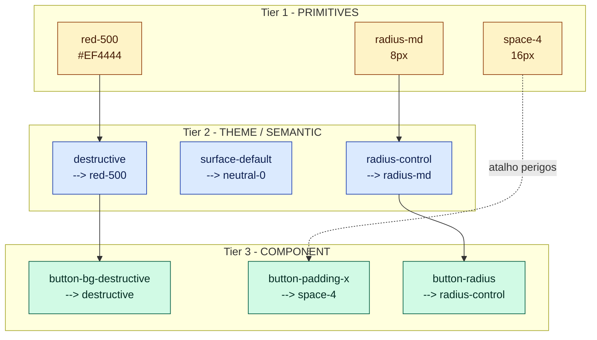
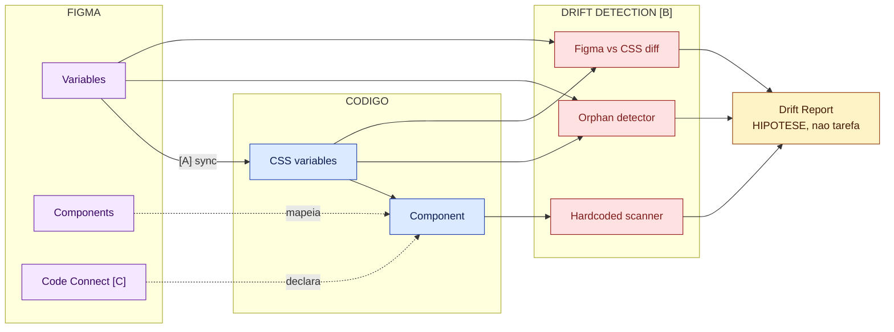
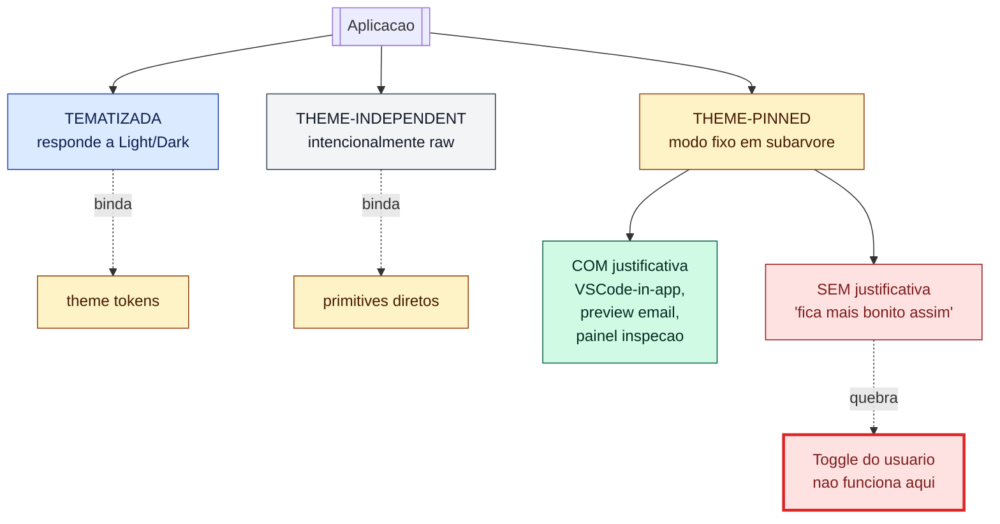
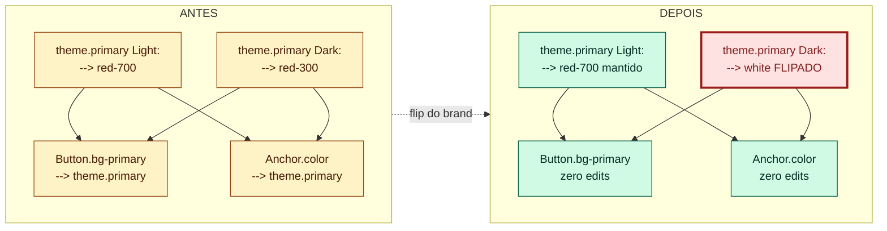

# Pilares de um Bom Design System

---

## Prefácio

Guia prático e curto: você lê em uma sentada, pega o jeito de DS, e fica capaz de **avaliar** um DS existente (o seu, o do cliente, o de uma biblioteca pública) com palavras precisas. Não é "tem cara de DS bom" — é "esse DS falha no pilar 4 porque X".

### Como ler

- **Iniciante** — leia em ordem; Parte 1 fixa vocabulário.
- **Já sabe HTML/CSS** — pule pra Parte 3 (pilares + checklists) e Parte 3.5 (smells de layout).
- **Quer só auditar** — leia os 6 checklists da Parte 3, a Parte 3.5 inteira, e o estudo de caso da Parte 4.

Companion: [design-system-ai-implementable.md](docs/design-system-ai-implementable.md) cobre o ângulo "DS bom é, por construção, AI-implementável". Não é pré-requisito; este doc fecha sozinho.

---

## Parte 1 — Vocabulário

### 1.1 Por que vocabulário importa

Discutir DS sem vocabulário compartilhado vira opinião — "essa cor está esquisita", "esse botão tinha que ser maior". Com vocabulário, vira argumento — "esse botão usa `red-500` direto em vez de `destructive`; quebra o pilar 1 e faz rebrand custar N edits".

A maioria das brigas em DS é vocabulário ruim, não desenho ruim.

### 1.2 Termos essenciais

**Token / Variable.** Token é o conceito (`nome → valor`). Variable é a encarnação numa ferramenta: Figma Variable, CSS Custom Property, chave de objeto JS. Nem toda variable é token — `--header-height-on-mobile-landscape: 48px` ad-hoc num componente é variável local. Token implica reuso e governança.

**Primitive.** Valor cru, sem semântica. `red-500 = #EF4444`, `space-4 = 16px`, `radius-md = 8px`. É o alfabeto do DS.

**Semantic / Theme token (alias).** Token que aponta pra outro, carregando intenção. `destructive → red-500`. O valor cru é o mesmo; o que muda é a promessa de uso. Theme token, alias, semantic token são, nesse doc, sinônimos. DTCG chama de "alias", outros DSs chamam de "system token" — conceito idêntico.

A diferença entre primitive e semantic é o que faz rebrand barato vs caro. Se você renomear `red-500` no componente, troca componente por componente. Se troca o alias, edita uma linha.

**Component-scope token.** Interno ao componente. `button-padding-x → space-4`, `button-bg-destructive → destructive`. Terceira camada — não polui a tabela global.

**Slot.** Ponto de extensão. `<Button leadingIcon={<DownloadIcon/>}>` — `leadingIcon` é slot. **`asChild`** (Radix UI) leva o conceito mais longe: o componente cede semântica ao filho, evitando wrapper. Útil para `<Button asChild><Link href="...">Ir</Link></Button>` — vira link mantendo estilo de botão. Pattern dominante em Radix, shadcn/ui, Headless UI.

**Variant.** Eixo discreto do contrato. `size: sm|md|lg`, `variant: primary|secondary|destructive`. É o **contrato visível**. Quando Figma e código divergem nos valores, há drift de contrato (pilar 3).

**State.** Estado run-time: `default`, `hover`, `focus`, `active`, `disabled`, `loading`. Diferente de variant porque não é escolhido pelo dev — é determinado pelo navegador / interação. Em Figma costumam ser variants explícitos (`state=hover`); em código, pseudo-classes (`:hover`, `:focus-visible`) ou data-attributes.

**Binding.** Ligação token ↔ propriedade visual. Em Figma: `Rectangle.fills` bound em `theme.surface-default`. Em código: `background-color: var(--surface-default)`. A maioria dos bugs de DS são bindings ausentes, na camada errada, ou stuck.

**Drift.** Divergência entre design e implementação. Drift de **valor** (Figma diz `#DC2626`, código diz `#DD2222`), de **estrutura** (Figma tem `size=lg`, código não), ou de **estado** (Figma tem `:focus` desenhado, código não tem `:focus-visible`). DS bom não evita drift; **detecta** drift.

**Revision vs Supersede.** Modelo de história de decisões. Revision: mudou parâmetro, mas a escolha ("Option letter") continua. Supersede: a escolha mudou. Discriminador binário: a Option letter mudou? Sim → Supersede. Não → Revision.

**Code Connect.** Mecanismo Figma para mapear declarativamente componente Figma → componente de código (`Component X é o <Button> ali`). Reduz fricção pra IA gerar código que respeita o DS. Sem Code Connect, IA depende de naming consistente + Figma Dev Mode MCP — funciona, é menos determinístico.

---

## Parte 2 — Foundations

Foundations são a **matéria-prima** do DS: cor, tipografia, forma, elevação, movimento. Antes de avaliar como um DS organiza matéria-prima (Parte 3), você precisa saber que matéria-prima é essa.

> **Aviso.** Esta parte cita Tailwind, Carbon, Radix, shadcn/ui como referência. **Referência ≠ prescrição.** Copiar um DS público inteiro porque "é o canon" é erro frequente, não conservadorismo. Use como vocabulário; escolha o subset que faz sentido pro seu produto.

### 2.1 Cor

Cor é a foundation mais densa — concentra ~50-70% dos tokens e a maior parte dos bugs de drift. Vale tempo.

**Color ramp.** Sequência ordenada de tons: `red-50, red-100, ..., red-900, red-950` (convenção Tailwind, 11 tons). Radix Colors usa 12 nomeados por papel funcional (`solid`, `border`, `text-low-contrast`); Carbon usa 10. Menos que ~10 fica curto; mais que ~13 vira ruído. **Pra DS novo, copiar a convenção Tailwind tem menor atrito.**

**Quais cores ganham ramp?** No mínimo: 1 neutral + 1 primary (brand) + 4 semânticas (success, warning, danger, info). Total típico: 6-8 ramps × ~11 tons = ~70-90 primitives.

**Espaços de cor: HEX → HSL → OKLCH.**
- HEX: compacto, péssimo pra gerar ramps por cálculo.
- HSL: manipulável (`lightness - 10%` escurece) mas perceptualmente desuniforme — 10% de lightness em amarelo apaga; em azul, escurece pra quase preto.
- **OKLCH**: perceptualmente uniforme, suportado nativamente em CSS desde 2023. Tailwind v4 default. Estado da arte.

```css
--red-500: #EF4444;                      /* HEX inerte */
--red-500: hsl(0 84% 60%);                /* HSL inconsistente */
--red-500: oklch(0.628 0.258 27.6);       /* OKLCH uniforme */
```

Caveats de OKLCH em DS legado: gamut clipping em sRGB, conversão não é lossless visualmente, `color-mix` em sRGB pode regredir. Pra DS novo, OKLCH; pra legado, planeje migração.

**Light/Dark como duas resoluções.** Em DS que respeita o pilar 5, Light e Dark **não são duas listas** — são duas **resoluções** do mesmo conjunto de aliases:

```
theme.surface-default
  Light → neutral-0    (#FFFFFF)
  Dark  → neutral-950  (#0A0A0A)

theme.primary
  Light → red-700      Dark → red-300
```

Componente bind em `theme.surface-default` uma única vez; o modo decide qual primitive resolve. Atenção: **dark mode bom não é light mode invertido** — contraste óptico funciona diferente, frequentemente exige ajuste de saturação.

**Diagrama: camadas de cor.** O diagrama vale pra qualquer foundation, mas o caso principal é cor. **Componentes consomem theme (camada 2) ou component-scope (camada 3), nunca primitives (camada 1) diretamente.**



A flecha tracejada `space-4 -.-> button-padding-x` sinaliza o anti-pattern: bind primitive direto em component-scope, pulando theme.

### 2.2 Tipografia

Tipografia é onde imaturos têm 50 estilos com nomes ad-hoc; maduros têm 10-15 Text Styles canônicos. Roleiro genérico bem aceito: `Display L/M/S` (hero), `Headline L/M/S` (títulos de página), `Title L/M/S` (títulos de card/seção), `Body L/M/S` (leitura), `Label L/M/S` (botões, chips, micro-tipografia). 15 estilos é teto; a maioria dos produtos usa 10-13.

Cada nível define `fontSize`, `lineHeight`, `letterSpacing`, `fontWeight`. Em Figma vira **Text Style** (`Body/M`); em código vira classe Tailwind ou CSS.

**Por que ter typescale?** Sem ele, cada designer escolhe `18px` ou `19px` pra "subtítulo" conforme o vento. Com ele, todos os subtítulos são `Title/L` e mudar do produto inteiro é uma edição.

**Foundation embaixo do Text Style.** O Text Style também aponta pra um **token de foundation** (`fontFamily-base`, `fontWeight-medium`):

```
foundation:    fontFamily-base = 'Inter'
text-style:    Body/M (fontFamily=fontFamily-base, fontSize=16, ...)
node:          aplica Body/M
```

Trocar Inter por Roboto = 1 edit no foundation. Pilar 1 em ação. **Migração de fonte só é viável se a foundation está em camadas** — se você não troca a fonte do produto inteiro com 1-2 edits, sua tipografia ainda não é DS, é coleção de literais.

### 2.3 Forma

"Forma" no DS = corner radius. Foundation mais subestimada e mais fácil de bagunçar.

```
radius-none   0    radius-md     8     radius-2xl    24
radius-xs     2    radius-lg     12    radius-full   9999
radius-sm     4    radius-xl     16
```

7-8 valores. Não 30. Aceite que `radius-sm` (4) ou `radius-md` (8) cobrem 95% dos casos; rejeite os 5% que insistem em valores únicos.

**Forma como linguagem.** DS bom codifica a relação em theme tokens: `radius-control → radius-sm` (inputs, chips), `radius-card → radius-lg` (cards), `radius-pill → radius-full`. Aí Button bind em `radius-control`, não em `radius-md` direto.

### 2.4 Elevação

Elevação = sensação de "acima". Em DSs ricos (estilo materialista) é tão fundamental quanto cor; em DSs flat (Tailwind-style) aparece sutil — sombras leves só pra sobreposição.

```
elevation-0   sem sombra        elevation-3   menus, tooltips
elevation-1   cards estáticos   elevation-4   modals, dialogs
elevation-2   hover/interativo  elevation-5   overlays full-screen
```

Cada level resolve pra um conjunto de `box-shadow`s — geralmente 2 empilhadas (uma curta densa pra nitidez, uma longa difusa pra profundidade). Em Dark mode, sombra preta sobre fundo escuro fica invisível — alguns DSs substituem (parcialmente) sombra por **surface tint** (camada translúcida da brand sobre a superfície, mais intensa quanto maior a elevação). Custa tokens extras `surface-tint-1..5`; vale se o produto é dark-first.

**Por que é foundation, não decoração.** Comunica hierarquia. Sem tokens, cada modal/popover/dropdown vira sombra ad-hoc — drift visual em semanas.

### 2.5 Movimento

Foundation que só recentemente virou first-class. Em produtos com animação forte (mobile, brand expressiva), merece tokens. Em enterprise estático, fica nota de rodapé.

**Duration:** `duration-xs 80ms` (microestados), `duration-sm 140ms` (chip/switch), `duration-md 240ms` (cards/panels), `duration-lg 400ms` (overlays).

**Easing (curvas canônicas):** `ease-standard cubic-bezier(0.2,0,0,1)` (uso geral), `ease-emphasized cubic-bezier(0.05,0.7,0.1,1)` (entradas dramáticas), `ease-decelerate cubic-bezier(0,0,0,1)` (entrando), `ease-accelerate cubic-bezier(0.3,0,1,1)` (saindo).

**Regra empírica:** se a animação aparece 2+ vezes no produto, vira token.

---

## Parte 3 — Os 6 pilares avaliativos

Cada pilar tem o mesmo formato: tese curta, por quê, smell↔fix em tabela, checklist. Aluno deve conseguir escanear em 60 segundos.

Mnemônico: **T-N-C-F-T-D** (Tokens, Nomeação, Contrato, Fonte única, Theming, Decisões).

### Pilar 1 — Tokens em camadas

**Tese.** Pra cor, semântica é obrigatória. Pra outros domínios (espaço, radius, duração), semântica precisa de razão funcional — alias por simetria é pior que primitive direto.

**Por quê.** Sem camadas: rebrand é find-and-replace gigante, dark mode exige editar componente por componente, IA não sabe qual cor é "primary". Com camadas: rebrand edita aliases, dark mode é segunda resolução, IA aponta pra `theme.primary` e o sistema resolve.

| Smell | Fix |
|---|---|
| `red-500` aparece dezenas de vezes em componentes | Crie `theme.destructive → red-500`; bind componentes em `destructive` |
| Dark mode estimado em "semanas" e parado há meses | Pilar 1 quebrado; refatorar antes de tentar Dark |
| Tabela com >200 entradas misturando primitives e aliases | Separe em arquivos: `primitives.css`, `theme.css` |
| Aliases vagos tipo `space-md-2` (alias por simetria) | Use primitive direto (`space-4`) ou alias com razão funcional (`radius-control`) |
| `theme.dark.primary` (modo virou nome) | Refatore pra `theme.primary` resolvendo por modo |

**Checklist.**
- [ ] Existe camada de primitives explícita?
- [ ] Existe camada de theme com nomes semânticos?
- [ ] Pra **cor**: componentes consomem theme (não primitives)?
- [ ] Light/Dark são duas resoluções do mesmo conjunto (não dois themes paralelos)?
- [ ] Há lint que acusa primitive direto em componente?

Se ≥3 estão "não", o pilar 1 está mal.

---

### Pilar 2 — Nomeação por intenção

**Tese.** Nomes descrevem propósito, não aparência.

**Por quê.** Se a brand virar azul amanhã, quantos tokens precisam ser renomeados? **Zero**, num DS bom. Nome é contrato — `brand-blue` promete "essa cor azul"; trocar a cor quebra. `primary` promete "tom da marca"; trocar a cor mantém o contrato. Vida útil do DS depende disso.

| Smell | Fix |
|---|---|
| `text-light`, `text-medium`, `text-dark` (descreve aparência) | `text-muted`, `text-default`, `text-strong` (hierarquia) |
| `error-red` em código de componente | `destructive` (intenção) — `error-red` pode existir só como primitive |
| `brand-blue`, `colorBrandBlueDarkMode` | `primary`; cores vivem em primitives, theme nomeia papel |
| `header-bg` (nome do componente vaza pro token) | `surface-app-chrome` ou `surface-elevated` (papel, não componente) |
| `text-12px` na camada theme | `label-sm` ou `text-caption` (papel; tamanho fica em primitive) |
| `dark-mode-bg` como token | `surface-default` resolvendo por modo |

**Bom referencial.** shadcn/ui usa 8 nomes (`primary`, `destructive`, `secondary`, `muted`, `accent`, `border`, `input`, `ring`) que cobrem 90% do uso, todos por papel. Polaris (Shopify) usa `bg-fill-success`, `bg-fill-critical` — papel + estado, não matiz. Carbon (IBM) tem nomes do tipo `text-primary`, `support-error`, `interactive-01`.

**Checklist.**
- [ ] Nomes na camada theme não mencionam cor, tamanho concreto, ou aparência?
- [ ] Há separação clara: primitives nomeiam aparência, theme nomeia intenção?
- [ ] Renomear `red-500` → `crimson-500` não exigiria editar componentes?
- [ ] Há convenção documentada pra nomes novos (ex: "use papel, não cor")?

---

### Pilar 3 — Contrato de componente

**Tese.** Os mesmos eixos existem no Figma, no código, e no catálogo de stories. A11y (acessibilidade — numerônimo de `a` + 11 letras + `y`) é default, não opcional.

**Por quê.** Drift estrutural (`Button size="xl"` que existe no Figma mas não no código) é mais grave que drift de valor. A11y default importa porque, sem ele, cada consumidor reinventa: um esquece focus, outro aria-label, outro estado disabled — vira loteria.

| Smell | Fix |
|---|---|
| Figma tem `Button/size=lg` mas código não | Adicione no código ou remova do Figma — case a case |
| `:focus` aparece só quando consumidor adiciona `outline` | Componente do DS implementa `:focus-visible` por default |
| Disabled é `opacity: 0.5` (cai abaixo de WCAG 4.5:1) | Tokens `text-disabled`, `bg-disabled` mantendo contraste mínimo |
| `<div onClick>` em vez de `<button>` | Semântica HTML correta por default; use Radix/Headless UI pra keyboard |
| Sem `prefers-reduced-motion` | Tokens de duração com fallback condicional |
| Cada uso copia `aria-label="Fechar"` | Default sensato no componente; consumidor sobrescreve se quiser |
| Stories só têm `default` state | Catálogo cobre cada `variant × state` |

**WCAG 2.2** (2023): SC 2.4.11 (foco não-obscurecido), SC 2.5.7 (alternativa por clique pra drag), SC 2.5.8 (target ≥ 24×24 CSS px). DS bom em 2026 considera no contrato.

**Checklist.**
- [ ] Cada variant Figma existe no código com mesmo nome?
- [ ] Cada state desenhado é alcançável (pseudo-classe ou data-attr)?
- [ ] `:focus-visible` é default, não opcional?
- [ ] Componente tem semântica HTML/ARIA correta sem prop extra?
- [ ] Há story/test pra cada combinação variant × state?

---

### Pilar 4 — Fonte única alinhada (Figma ↔ código)

**Tese.** O drift que você não mede é o drift que cresce. Automação acusa, humano decide.

**Por quê.** Sem alinhamento, DS vira folclore ("você é novo, não usa essa cor; usa aquela"). Automação resolve drift de valor (Figma e código discordam) e drift de cobertura (hardcoded em vez de token).

**Nuance importante:** o relatório é **hipótese, não tarefa.** Aponta "aqui há 30 hardcodes"; humano valida quais merecem virar token. Tratar drift report como tarefa cega leva a "vamos só substituir tudo" — e quebra coisas.

**Três sub-preocupações com custos diferentes:**

| Sub | O que é | Custo | ROI |
|---|---|---|---|
| **A. Sync Figma → código** | Pipeline (Tokens Studio, script) que exporta Figma vars como CSS vars | Médio (~3 dias setup) | Alto se time muda tokens com frequência |
| **B. Drift detection** | Scanners em CI: hardcoded, órfão, value differ | Baixo (~1 dia) | Alto sempre |
| **C. Code Connect mapping** | Mapeamento Figma↔código | Médio-alto (manutenção) | Alto se IA / Dev Mode é parte do fluxo |

Comece por **B** (mais barato, vale sempre); adicione A se ciclo de tokens é dinâmico; considere C como acelerador.



| Smell | Fix |
|---|---|
| Sync "quando alguém lembra" | Pipeline em CI; falha bloqueia merge |
| Hardcoded `#FFFFFF` em CSS de componente | Hardcoded scanner em CI rejeita; dev usa `surface-default` |
| Tokens órfãos detectados há semanas, ninguém deletou | Scan = hipótese — valide cruzando com Inspect output antes de deletar |
| Drift report rodou, deletaram em massa, produto quebrou | Trate report como hipótese; pre-flight de validação cruzada |
| Documentação em README desatualizado | Fonte única não é única se README discorda do código — gere do código |

**Checklist.**
- [ ] Existe pipeline (manual ou auto) que exporta Figma vars pra código?
- [ ] Hardcoded scanner roda em CI ou pré-commit?
- [ ] Detector de tokens órfãos existe?
- [ ] Drift reports geram issue/alerta (não só log)?
- [ ] Time trata reports como hipóteses, valida antes de agir?

---

### Pilar 5 — Política explícita de theming

**Tese.** Theming é escolha, não default. Onde tem theme, deve haver razão. Onde não tem, também.

**Por quê.** DSs juniores aplicam theming "em tudo" e descobrem tarde que algumas zonas não deviam (player de vídeo, splash branded, embed de email). Outros aplicam "em pedaços" sem decidir, e o usuário troca pra Dark com partes que não acompanham. Política explícita resolve: cada zona é escolha consciente.

**Três tipos de zona:**

1. **Tematizada** — bind theme tokens. Light/Dark muda. Default da maioria.
2. **Theme-independent** — bind primitives ou cores fixas. Não muda. Razão **deve** ser documentada.
3. **Theme-pinned** — `data-theme="dark"` setado em subárvore com **justificativa explícita**. Legítimo: editor de código embutido com tema próprio, preview de email forçado em Light, painel mostrando Light+Dark lado a lado, trecho branded com identidade fixa. **NÃO legítimo:** "fica mais bonito assim" — anti-pattern, quebra o toggle global.



| Smell | Fix |
|---|---|
| Player de vídeo continua claro no Dark, sem doc | Comportamento correto — documente como zona theme-independent |
| Subárvore Light dentro de produto Dark sem razão | Anti-pattern; remova `data-theme` ou justifique como theme-pinned |
| Dark mode = `filter: invert(1)` | Refatore pra theme tokens; Dark é resolução, não filtro |
| `if (theme === 'dark')` em business logic | Theme deve ser CSS-only; vazou pra app code |
| "Dark mode" desenhado como Light invertido | Redesenhe Dark separadamente — contraste óptico funciona diferente |

**Checklist.**
- [ ] Existe doc listando zonas theme-independent + razão?
- [ ] Toggle Light/Dark funciona globalmente sem subárvores quebradas?
- [ ] Theme-pinning, quando existe, tem justificativa registrada?
- [ ] Light e Dark foram desenhados separadamente?

---

### Pilar 6 — Decisões versionadas

**Tese.** Toda decisão de DS tem motivo, data, e dependentes. História é parte do DS.

**Por quê.** DS é corpo de decisões muito mais que de tokens. "Por que `radius-md` é 8 e não 6?" "Por que existe `theme.cta` separado de `theme.primary`?" Sem registro, novos contribuidores recriam pensamento errado: sugerem juntar tokens, "limpam" tokens que parecem órfãos, substituem valores "esquisitos" por "redondos".

**Modelo:**
- **Revision** — mesma escolha, parâmetro/prose drift. Append inline no TD existente.
- **Supersede** — escolha diferente. Novo TD; marker no antigo.

Discriminador binário: a Option letter mudou? Sim → Supersede. Não → Revision. Forward-only — história antes do modelo é "opaca" (cobre `git log`).

```
TD-04: Border radius do Button
  Option B (escolhida): 8px

REVISION (mesma Option):
  - 2026-04-12 — Aumentado de 8 para 10px após teste de usabilidade.
    Rationale: usuários reportavam cantos cortantes em mobile.

SUPERSEDE (Option mudou):
  TD-04 ganha marker: <!-- status: superseded-by: button-redesign/TD-08 -->
  Novo TD em outro doc decide Option C: pill-shaped (radius: 9999).
```

| Smell | Fix |
|---|---|
| "Por que esse token existe?" → "não sei" | Adote Revision/Supersede a partir de hoje; TDs novos exigidos |
| Tokens fantasmas em uso, ninguém sabe quem criou | Arqueologia seletiva (não tudo de uma vez) — só nos críticos |
| Mudanças só em PR description, sem decision doc | Cada token novo nasce com TD curto (5-10 linhas em prosa) |
| Time recria a discussão `primary` vs `brand` toda vez | TD inicial responde; revisita só com TD novo |
| TDs viraram documento de 50 páginas que ninguém lê | Mantenha leves — se vira burocracia, ninguém faz e o pilar morre |

**Checklist.**
- [ ] Cada token não-trivial tem decisão registrada (motivo, data)?
- [ ] Há distinção formal entre Revision e Supersede?
- [ ] Decisões superseded preservam link bidirecional?
- [ ] Time novo, lendo, entende o estado atual?
- [ ] Decisões são leves o suficiente pra serem feitas?

---

## Parte 3.5 — Smells de layout

Os 6 pilares cobrem **estrutura de tokens e contrato**. Mas DS bom também produz **layout robusto** — UI que não quebra quando o conteúdo muda, a tela encolhe, ou o usuário traduz pra alemão. Estes são os 10 smells de layout que aparecem com mais frequência em código de frontend dev em formação.

Cada item: **Errado** (o que tipicamente se faz) → **Certo** (o fix) → **Por quê** (o caso onde quebra).

### Layout flow / sizing

**1. `position: absolute` pra posicionar dentro do fluxo.**
- *Errado:* `<div style="position:absolute; top:20px; left:30px">` pra empurrar elemento dentro de container.
- *Certo:* flex/grid + `gap` ou `margin` pra posicionar; absolute só pra overlay (badge sobre avatar, tooltip, dropdown).
- *Por quê:* absolute remove do flow; conteúdo abaixo não reage. Quebra quando o container redimensiona ou o conteúdo cresce.

**2. Larguras fixas em `px`.**
- *Errado:* `width: 320px` pra "ficar do tamanho do design".
- *Certo:* `max-width: 32rem` + `width: 100%`; ou `clamp(16rem, 50%, 32rem)` pra fluido com limites; em grid, `minmax(0, 1fr)`.
- *Por quê:* px hard-coded ignora viewport, zoom, e densidade. O design é alvo, não literal.

**3. Falta de `min-width: 0` em flex-item com texto.**
- *Errado:* `<div style="display:flex"><span>{longTitle}</span><Button/></div>` — texto longo empurra o botão pra fora.
- *Certo:* `<span style="min-width:0; flex:1">` no item que tem texto; ou `overflow:hidden text-overflow:ellipsis` se truncar é a intenção.
- *Por quê:* o default de `min-width` em flex-item é `auto` (≈ tamanho intrínseco do conteúdo). Texto longo não respeita o container — vaza silenciosamente.

**4. `margin` no filho em vez de `gap` no container.**
- *Errado:* `<Card style="margin-bottom: 16px">` repetido em cada card; último com `margin-bottom: 0`.
- *Certo:* `<List style="display:flex; flex-direction:column; gap:16px">`; cards sem margin.
- *Por quê:* gap é responsabilidade do container; margem no filho double-counta com vizinhos, não funciona com flex/grid wrap, e exige hack pro último item.

### Conteúdo dinâmico

**5. `overflow: hidden` como solução.**
- *Errado:* "estourou? `overflow: hidden`" — esconde o sintoma, mantém o bug.
- *Certo:* identifique a causa (texto longo? imagem sem `max-width`? flex sem `min-width: 0`?) e fixe a causa. Use `overflow: hidden` só quando truncar é a intenção (`text-overflow: ellipsis`, carrossel).
- *Por quê:* `overflow: hidden` esconde scroll legítimo, corta focus ring, e mascara o problema real.

**6. Sem estratégia pra string longa (i18n).**
- *Errado:* botão `<Button>Save</Button>` com largura justa; quando vira `<Button>Сохранить настройки</Button>`, estoura.
- *Certo:* wrapping é o default — deixe quebrar linha. Truncation com `…` só com critério explícito (largura máxima, contexto onde linha extra é ruim, ex: tabela de uma linha).
- *Por quê:* alemão tem ~30% mais letras que inglês; russo + chinês variam ainda mais. Truncar perde informação e cria fricção. Wrap é o conservador.

**7. `height` fixo em `px` em container de texto.**
- *Errado:* `<h2 style="height: 32px">` — corta ascender/descender, e quebra quando line-height muda.
- *Certo:* nada de `height`; deixe o texto definir altura. Use `min-height` se precisa garantir piso; `padding-block` se precisa folga.
- *Por quê:* tipografia tem métricas (ascender, descender, leading) que dependem de fonte e weight. Fonte trocada → altura quebra.

### Robustez e acessibilidade de layout

**8. Touch target < 24×24 CSS px (idealmente 44×44).**
- *Errado:* `<IconButton size="16px">` pra ícone de fechar — clicável que vira hostil em mobile.
- *Certo:* `min-width: 44px; min-height: 44px` (Apple HIG / WCAG 2.5.5 Level AAA); WCAG 2.2 SC 2.5.8 exige mínimo 24×24 (Level AA). Para ícones pequenos, expanda área clicável com `padding` ou `::before` invisível.
- *Por quê:* tap em mobile com dedo precisa de área generosa; alvo pequeno gera erros de clique.

**9. Breakpoints hard-coded em px no componente.**
- *Errado:* `@media (max-width: 768px) { ... }` repetido em 30 arquivos.
- *Certo:* tokens (`--breakpoint-md: 48rem`); ainda melhor: **container queries** (`@container (max-width: 32rem)`) — componente reage ao seu próprio container, não ao viewport global. Suporte estável desde 2023.
- *Por quê:* breakpoint hard-coded em px assume viewport global; container query reage ao espaço real do componente. Componente reusável em sidebar e em main precisa.

**10. `z-index` ad-hoc (`9999`, `999999`).**
- *Errado:* `z-index: 99999` quando "não tava aparecendo".
- *Certo:* escala curta de tokens — `z-base: 0`, `z-dropdown: 10`, `z-sticky: 20`, `z-modal: 100`, `z-toast: 200`. Use só o token; nunca número solto.
- *Por quê:* sem escala, o produto vira corrida pelo z maior. Componentes brigam, dropdown some atrás de modal sem ninguém saber por quê.

---

## Parte 4 — Estudo de caso: Primary flip

Os 6 pilares e os 10 smells são silos didáticos. A vida real é interconectada — quase todo bug sério em DS cruza 2-3 pilares de uma vez. O caso a seguir é real: rebrand parcial num produto interno (StreamTube), abril/2026.

**Pilares envolvidos:** 2 (nomeação) + 5 (theming) + 6 (decisões).

**Contexto.** Brand vermelha. `theme.primary` resolvia pra `red-700` em Light e `red-300` em Dark — padrão clássico "tom escuro no Light, tom claro no Dark".

Em determinado ciclo de design, a brand decidiu: em Dark, o primary deveria virar **branco puro** (`neutral-0`), com texto em preto puro. Escolha de design — mais shadcn-style, contraste binário.

**Onde poderia ter dado errado.** Em DS sem camadas (pilar 1 quebrado):
- Editar Button: `background: var(--red-300)` → `background: var(--neutral-0)` em Dark.
- Editar Anchor, Badge, Chip: idem.
- Editar ~30 outros componentes.
- Verificar que ninguém usava `red-300` pra outra coisa em Dark.

Tempo estimado: 2-3 dias. Risco de breakage: alto.

**Onde acertou.** Pilares 1 + 2 já estavam firmes. Componentes apontavam pra `theme.primary` e `theme.primary-foreground`, não pra primitives. A mudança real foi:

```diff
/* theme.css — Dark mode */
:root[data-theme="dark"] {
- --theme-primary: var(--red-300);
+ --theme-primary: var(--neutral-0);
- --theme-primary-foreground: var(--neutral-0);
+ --theme-primary-foreground: var(--neutral-1000);
}
```

Dois tokens. Componentes não foram tocados. Tempo total: ~1 hora (incluindo verificação visual).

**Cascata derivada.** Como `theme.primary` fluía pra `theme.sidebar-primary` (alias-de-alias), esse último mudou automaticamente. Em revisão, percebeu-se que algum CTA específico apontava pra `theme.link` em vez de `theme.primary` — corrigido. Ajuste opcional, não exigido pela mudança original.

**Decisão.** Por ter mudado o **valor** mas não a **escolha** (a escolha continuou "primary é a cor principal da brand"), foi registrado como **Revision** no TD original:

```
TD-12: theme.primary
  Option A (escolhida): cor principal da brand, resolvida por modo
  Light → red-700; Dark → red-300

  Revisions:
  - 2026-04-30 — Dark flipou para neutral-0 (branco). Rationale: brand
    decidiu contraste binário em Dark mode; alinha com shadcn-style.
```

Não foi Supersede — a Option (cor principal da brand resolvida por modo) continuou. Só os parâmetros mudaram.



**Lições.**

1. **Custo de rebrand é proporcional ao tamanho da camada theme**, não do produto. Um produto de 200 telas pode ter 30 theme tokens; mudar 5 muda 200 telas.
2. **Pilar 2 isola a brand.** Se o token chamasse `dark-red-light`, o flip teria sido inviável (nome contradiz valor).
3. **Pilar 6 evita refazer a discussão.** Sem decision log, três meses depois alguém olha o Dark com `theme.primary = white` e pensa "isso parece bug, devia ser cor da brand" — propõe reverter. A revisão registrada no TD-12 (one-liner com data + rationale) intercepta esse loop com 30 segundos de leitura. Em DSs sem pilar 6, esse loop acontece a cada novo time; com pilar 6, acontece uma vez e fica registrado.
4. **Aliases-de-aliases têm cascata silenciosa.** O sidebar-primary ajustou sozinho — correto, mas merece verificação visual.

---

## Parte 5 — Apêndice: bootstrap em 8 passos

Você terminou o doc e quer começar um DS do zero. **Esqueleto, não receita exaustiva** — cada item viraria semanas. O valor desta seção é a **ordem** e o **que NÃO fazer no início**.

1. **Foundations: cor + tipografia primeiro.** Neutral ramp + 1 primary ramp (~22 primitives) + ~10 Text Styles (Display/Headline/Title/Body/Label, 2-3 sizes cada). Resista a forma/elevação/movimento antes de cor+tipo firmes.
2. **Theme como segunda camada.** 8-12 aliases iniciais — `surface-default`, `surface-raised`, `text-default`, `text-muted`, `border-default`, `primary`, `primary-foreground`, `destructive`, `destructive-foreground`. Light + Dark como duas resoluções.
3. **Componente piloto: Button.** Variants `size` + `variant`, states default/hover/focus/active/disabled. Figma + código + catálogo de stories com todas as combinações. Esse componente é o modelo mental pros próximos 30.
4. **Drift detection mínima.** Hardcoded scanner em CI: rejeita `#XXX` em arquivos de componente. Whitelist documentada. ~1 dia de implementação.
5. **Política de theming explícita.** 1 página: zonas tematizadas (todas) + theme-independent (provavelmente nenhuma no início). Revisar quando alguma zona migrar.
6. **Decision log.** 1 doc que cresce. Cada token novo: 5 linhas. Modelo Revision/Supersede. Ler em ordem cronológica dá conta da história.
7. **Adicionar foundations restantes sob demanda.** Forma quando o terceiro componente repetir o mesmo radius. Elevação quando o segundo overlay for criado. Movimento quando a segunda transição compartilhada. Não no dia 1.
8. **Code Connect só depois do DS estabilizado.** Mappings consomem tempo de manutenção; só vale a pena quando o componente está estável.

**O que NÃO fazer no início:**

- Motion tokens, dynamic theming, multi-brand, color blending sofisticado — tudo depois.
- "Cobrir todos os casos" — DS bom **rejeita casos** mais do que aceita.
- Documentação separada de 50 páginas — apodrece. Documente em paralelo com o código.
- "Qualquer designer pode contribuir" — otimize pra 2-3 pessoas mantendo coerência. Escala depois.

**Governança — o pilar não-técnico.** Os 6 pilares cobrem estrutura técnica; **governança** é onde maioria dos DSs morre. Quem aprova token novo? Quando vira componente do DS vs local? Como rejeita pedido? Em produtos pequenos (1 squad), informal basta — decisão na conversa, registro no log. Em produtos médios+, informal não escala. Mencione no plano de bootstrap, mesmo que seja "1 pessoa decide tudo nas primeiras 8 semanas, depois revisitamos".

---

## Para onde ir depois

- **DTCG — Design Tokens Format Module** — [designtokens.org/tr/2025.10/format/](https://www.designtokens.org/tr/2025.10/format/). Spec normativa do formato (`$value`, `$type`, alias resolution). Curta, densa, é o vocabulário comum que ferramentas como Tokens Studio e Style Dictionary tentam implementar.
- **Carbon, Polaris, shadcn/ui** — DSs públicos com filosofias diferentes. Compare como cada um trata os 6 pilares; nenhum é prescrição, todos são vocabulário.
- **OKLCH** — [oklch.com](https://oklch.com/) (interativo) e o blog do Andrey Sitnik. Pra devs que vão construir cor de DS.
- **CSS layout: MDN Flexbox + container queries** — [developer.mozilla.org/en-US/docs/Web/CSS/Guides/Flexible_box_layout](https://developer.mozilla.org/en-US/docs/Web/CSS/Guides/Flexible_box_layout). Lê o "min-width: 0 trick", `flex-grow/shrink/basis`, e container queries.
- **WCAG 2.2** — [w3.org/TR/WCAG22/](https://www.w3.org/TR/WCAG22/). SC 2.4.11, 2.5.7, 2.5.8 são os mais relevantes pra DS.
- **ADRs** — Michael Nygard, "Documenting Architecture Decisions" (2011). Pra entender o pilar 6.
- **Companion**: [docs/design-system-ai-implementable.md](docs/design-system-ai-implementable.md) — DS bom é AI-implementável por construção.
